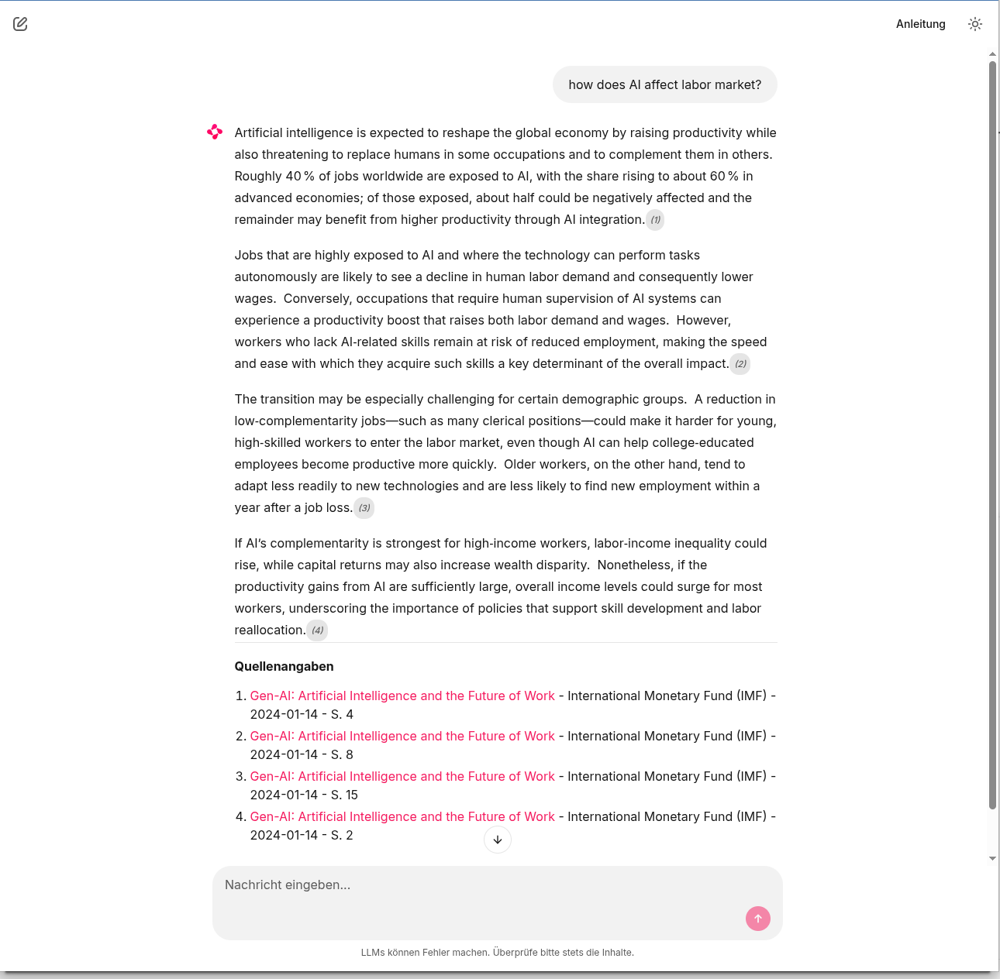
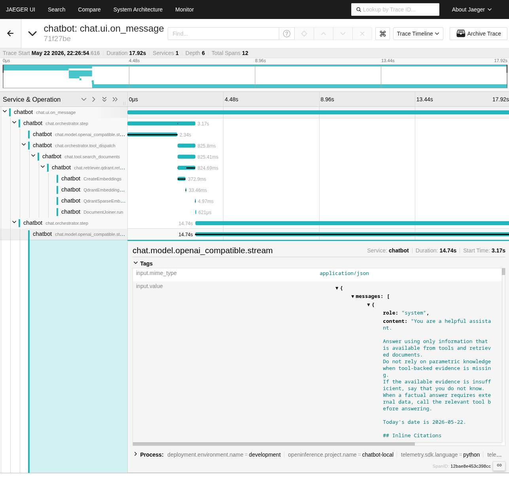
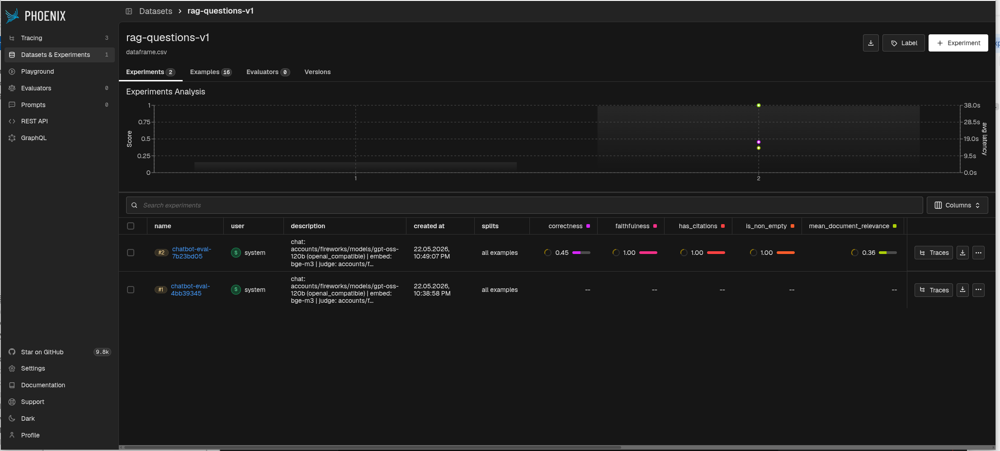

# RAG Chatbot

Retrieval-augmented generation chatbot running on local infrastructure using **Chainlit**, **Haystack**, **Ollama**, and **Qdrant**.

Answers domain questions grounded in static company documents (txt / md) with citation-style source references. Includes a typed tool call for vacation-days lookup backed by a simple username/password simulation.



---

## About This Project

This started as a structured learning exercise: build a real RAG chatbot from scratch, make deliberate architectural choices, and see what it actually takes to get a system like this to work well. It is not production software — it is a **showcase** of the concepts, patterns, and tradeoffs encountered along the way.

### Highlights

**AI-assisted, human-steered development** — The code was written in close collaboration with an AI agent, but the architectural structures, module boundaries, and design decisions are mine. The agent helped with implementation; I decided what to build and how to structure it.

**Clean ingestion + chatbot boundaries** — The system cleanly separates document ingestion (`src/ingest`) from the chatbot runtime (`src/chatbot`), with `Protocol`-based interfaces at every module boundary. No orchestration code imports infrastructure directly.

**Citations as a first-class concern** — Source attribution is not an afterthought. A dedicated citation layer uses tailored prompts and a streaming parser to embed citation markers directly in the answer stream, parsed and rendered in the UI as the response flows.

**Multi-modal ingestion** — PDFs are ingested page by page, including images. Each image is described by a vision model (Ollama), and those descriptions become searchable chunks alongside the text, making image-heavy documents genuinely retrievable.

**Instrumentation as a development discipline** — OpenTelemetry tracing (Phoenix + Jaeger) proved indispensable. Without it, tuning retrieval, prompts, and model behavior is guesswork. Tracing made the difference between "something is off" and "this specific retrieval step returned the wrong chunks."

**Evaluation matters — and LLM-as-a-judge is tricky** — Running systematic experiments with Phoenix Experiments gave concrete signal on what actually improves quality. The catch: results vary dramatically depending on which model acts as the judge.

**i18n-ready by design** — No user-facing string is hardcoded in the backend. Every message a tool or citation layer emits is an `I18nMessage` value object; all display strings live in a single translation map in the UI layer (`i18n_messages.py`). Swapping in a real translation framework — or adding a language — requires touching exactly one file.

**Local vs. cloud models** — Ollama is excellent for local iteration, but on aging hardware (a 5-year-old machine) some models are too slow for a comfortable feedback loop. Switching to a cloud provider via the `openai_compatible` adapter fixed that without any code changes.

### On RAG — What It Actually Means

RAG (Retrieval-Augmented Generation) is fundamentally about fetching relevant data and placing it in the LLM's context so the model answers based on that information rather than on its inherent, potentially stale, training knowledge.

At its simplest, you could just load all your documents and feed them to the model — "it all fits in the context window, problem solved." That is still technically RAG. The retrieval source does not have to be a vector store; a classic database query, a filesystem read, or a full-text search engine (Elasticsearch, OpenSearch) all qualify just as well.

What does matter is **retrieval quality**:
- Include all *relevant* documents — but as few *irrelevant* ones as possible. The more noise in the context, the higher the risk that the model gets confused and produces a poor answer.
- Larger context means more tokens, which means higher cost when using cloud models. (Token caching can help with cost, but the confusion risk from irrelevant content remains.)

This is why evaluation, tracing, and careful tuning of chunk size, overlap, and `top_k` are not optional extras — they are the core of making RAG work reliably.

### What I Learned

Modern Python — with `pyright` strict mode, `@dataclass(frozen=True)`, `Protocol` interfaces, and Pydantic at system boundaries — is genuinely pleasant to work in, even for developers who come from strictly typed languages.

More broadly: in the age of LLMs, fluency in a specific language's syntax matters less than the ability to **read and understand code**, apply the right design concepts, and work with an AI collaborator to produce idiomatic, clean solutions. This project reinforced that lesson throughout.

### If This Were Production

A few things would need to be reconsidered before running this in a real environment:

**Stateful architecture** — This is a Chainlit application, which is inherently stateful (WebSocket-based, one process per session). That is fine for a local showcase, but it is a problem for horizontal scaling, e.g. in Kubernetes. A production deployment would need to evaluate whether statefulness is appropriate or whether to move toward a stateless design — which in turn raises questions about WebSocket handling and session affinity at the load-balancer level.

**Do you actually need Qdrant?** — In a real deployment, the right question is whether a dedicated vector store is warranted at all. If the corpus is small, a simple database query or a full-text search against an existing Elasticsearch/OpenSearch cluster might be entirely sufficient — and avoids adding another piece of infrastructure to operate and maintain. And if semantic search *is* the right choice, be prepared to tune it: in this project, the choice of embedding model alone had an outsized impact on retrieval quality.

## Prerequisites

| Requirement | Version | Notes |
|---|---|---|
| Python | 3.12 | Pinned in `.python-version` |
| [uv](https://docs.astral.sh/uv/) | latest | Sole dependency/env manager — no pip/poetry |
| [Ollama](https://ollama.com) | latest | Runs models locally |
| Docker-compatible runtime | latest | Used to run Qdrant (Docker Desktop, Colima+Docker CLI, Podman, Rancher Desktop) |

---

## Setup

### 1. Clone and install

```bash
git clone <repo-url>
cd chatbot
uv sync
```

`uv sync` creates the virtual environment (`.venv/`), pins Python 3.12, and installs all dependencies from `uv.lock`.

### 2. Configure environment

```bash
cp .env.example .env
# Edit .env as needed — defaults work for a standard local setup
```

The most commonly changed variables:

| Variable | Default | Description |
|---|---|---|
| `CHAT_MODEL_PROVIDER` | `ollama` | `ollama` or `openai_compatible` |
| `CHAT_MODEL` | `qwen3.5:9b` | Model name — Ollama tag or provider model id |
| `CHAT_BASE_URL` | `http://localhost:11434` | Model endpoint URL |
| `CHAT_API_KEY` | — | Required for `openai_compatible` providers |
| `EMBEDDING_MODEL` | `bge-m3` | Embedding model (must match the indexed collection) |
| `QDRANT_HOST` | `localhost` | Qdrant hostname |

The chat model can also run via any OpenAI-compatible cloud provider (Groq, Together AI, …) by setting `CHAT_MODEL_PROVIDER=openai_compatible`. See [CONFIGURATION.md](CONFIGURATION.md) for the full variable reference, provider examples, and vision/tracing/evaluation settings.

### 3. Pull required Ollama models

```bash
# Runtime default chat model
ollama pull qwen3.5:9b

# Embeddings
ollama pull bge-m3

# Vision model (for multi-modal ingestion — can be skipped if VISION_INGESTION_ENABLED=false)
ollama pull qwen2.5vl:7b

# Test chat model (used by pytest via tests/conftest.py)
ollama pull llama3.2
```

The embedding and vision models always run locally via Ollama. The chat model can alternatively run via a cloud provider — see [CONFIGURATION.md](CONFIGURATION.md) for provider examples.
For tests, the suite pins `CHAT_MODEL=llama3.2` to keep test environments fast and reproducible even when the runtime default model changes.

### 4. Start Qdrant

```bash
docker run -d --name qdrant -p 6333:6333 qdrant/qdrant
```

Qdrant dashboard: <http://localhost:6333/dashboard>

macOS quick option (recommended): Colima + Docker CLI

```bash
brew install colima docker
colima start
docker run -d --name qdrant -p 6333:6333 qdrant/qdrant
```

Docker Desktop is not always required. For many local-dev setups, Colima is the simplest free alternative.

---

## Running the App

```bash
uv run chainlit run src/chatbot/ui/app.py
```

Opens a chat interface at `http://localhost:8000` by default.

---

## Local Tracing (OpenTelemetry + Arize Phoenix + Jaeger)

This project can emit OpenTelemetry traces for the full chat pipeline (UI turn, orchestrator rounds, model call, retrieval tool, and Qdrant retrieval).

### 1. Start local Phoenix

```bash
podman run -d --name phoenix -p 6006:6006 docker.io/arizephoenix/phoenix:latest
# or with Docker:
# docker run -d --name phoenix -p 6006:6006 arizephoenix/phoenix:latest
```

Phoenix UI: <http://127.0.0.1:6006>

### 2. Start local Jaeger

```bash
docker run --rm --name jaeger \
  -e COLLECTOR_OTLP_ENABLED=true \
  -e COLLECTOR_OTLP_GRPC_HOST_PORT=0.0.0.0:4317 \
  -e COLLECTOR_OTLP_HTTP_HOST_PORT=0.0.0.0:4318 \
  -p 16686:16686 \
  -p 4317:4317 \
  -p 4318:4318 \
  jaegertracing/all-in-one:1.59
```

Jaeger UI: <http://localhost:16686>

### 3. Enable tracing in `.env`

For a standard local setup, only this is required:

```bash
OTEL_ENABLED=true
```

All other tracing variables already have sensible defaults. In this project, Jaeger defaults to OTLP/HTTP (`/v1/traces`). Set them only when you want to override targets or behavior.

Optional overrides:

```bash
OTEL_SERVICE_NAME=chatbot
OTEL_PHOENIX_OTLP_ENDPOINT=http://localhost:6006/v1/traces
OTEL_EXPORT_PHOENIX=true
OTEL_EXPORT_JAEGER=true
OTEL_JAEGER_OTLP_ENDPOINT=http://localhost:4318/v1/traces
OTEL_SAMPLE_RATE=1.0
OTEL_CONSOLE_EXPORT=false
```

Optional Jaeger OTLP gRPC mode:

```bash
OTEL_JAEGER_OTLP_ENDPOINT=localhost:4317
```

Use gRPC mode only when port `4317` is reachable from the app process.

With `OTEL_ENABLED=true`, both exports are enabled by default. You can disable either backend independently:

```bash
# Phoenix only
OTEL_EXPORT_PHOENIX=true
OTEL_EXPORT_JAEGER=false

# Jaeger only
OTEL_EXPORT_PHOENIX=false
OTEL_EXPORT_JAEGER=true
```

### 4. Start chatbot and generate traffic

```bash
./chatbot.sh
```

Ask one or two questions in Chainlit, then open <http://localhost:6006> and inspect traces for service `chatbot`.

You can inspect the same traces in Phoenix (<http://localhost:6006>) and Jaeger (<http://localhost:16686>) when both exporters are enabled.

### 5. What you should see in traces

- Root UI span for each message (`chat.ui.on_message`)
- Orchestrator spans (`chat.orchestrator.process_message`, `chat.orchestrator.round`)
- Model call span (`chat.model.ollama.stream` or `chat.model.openai_compatible.stream`) with request/response previews
- Tool spans (`chat.tool.search_documents`) with tool input and result summary
- Retriever span (`chat.retriever.qdrant.retrieve`) with top-k result preview



### 5.1 Tracing Schema (Ownership Rules)

Tracing follows a strict ownership model so each span level contributes one readable view only:

- UI span (`chat.ui.on_message`): user input preview + final emitted assistant response preview.
- Orchestrator spans (`chat.orchestrator.*`): control-flow only (round state, tool dispatch summaries, citation-pass diagnostics).
- Model span (`chat.model.ollama.stream`): compact request message summary + model output preview.
- Tool spans (`chat.tool.*`): tool input plus tool-specific result summary.
- Retriever span (`chat.retriever.qdrant.retrieve`): retrieval parameters + compact chunk/content previews.

Canonical span names are centralized in `src/chatbot/observability/schema.py` and should be reused instead of hard-coded string literals.

### 6. Troubleshooting

- No traces in Phoenix:
  - Verify Phoenix is running on `http://localhost:6006`.
  - Verify `OTEL_ENABLED=true`, `OTEL_EXPORT_PHOENIX=true`, and endpoint matches `http://localhost:6006/v1/traces`.
- No traces in Jaeger:
  - Verify Jaeger is running with OTLP enabled (`COLLECTOR_OTLP_ENABLED=true`).
  - Verify Jaeger OTLP receivers are bound to all interfaces (`0.0.0.0`) when running in Docker.
  - For default OTLP/HTTP mode, verify endpoint is `http://localhost:4318/v1/traces`.
  - For gRPC mode, verify port mapping includes `-p 4317:4317` and endpoint is `localhost:4317`.
  - Verify `OTEL_ENABLED=true` and `OTEL_EXPORT_JAEGER=true`.
  - Set `OTEL_CONSOLE_EXPORT=true` temporarily to confirm spans are produced.
- Too many traces:
  - Lower `OTEL_SAMPLE_RATE`, e.g. `0.2`.

---

## Ingestion

Place source documents (`.txt`, `.md`) in the directory configured by `CORPUS_PATH` (default: `corpus/`), or use the example documents already provided in `corpus/`.

```bash
# Index (or re-index) all documents in CORPUS_PATH
uv run python -m src.ingest.cli reindex

# Wipe the Qdrant collection and re-index from scratch
uv run python -m src.ingest.cli reset

# Wipe the collection only, without re-indexing
uv run python -m src.ingest.cli reset --wipe-only
```

`reindex` uses an OVERWRITE duplicate policy, so running it again on unchanged files is safe — it replaces stale vectors rather than creating duplicates.

---

## Running the Test Suite

```bash
# Unit tests (no external services needed)
uv run pytest tests/unit/

# Integration tests (requires Qdrant + Ollama running; pytest pins CHAT_MODEL=llama3.2)
INTEGRATION_TESTS=1 uv run pytest tests/integration/

# All tests
uv run pytest
```

Integration tests are skipped automatically unless `INTEGRATION_TESTS=1` is set.  
To run them: start Qdrant and Ollama first, then run the command above.

---

## Linting and Type Checks

```bash
uv run ruff check .          # lint
uv run ruff format .         # format (in-place)
uv run ruff format --check . # format check only (CI mode)
uv run pyright               # strict type check
```

All four commands must pass cleanly before merging any branch. CI enforces this automatically on every pull request.

---

## Evaluation



```bash
# Run experiment against the default dataset (eval/datasets/rag_questions.jsonl)
uv run --group eval python eval/run_experiment.py

# Custom dataset / experiment name
uv run --group eval python eval/run_experiment.py \
  --dataset-file eval/datasets/rag_questions.jsonl \
  --experiment-name "retrieval-top-k-5"

# Quick sanity check (1 example, no Phoenix upload)
uv run --group eval python eval/run_experiment.py --dry-run
```

Drives the `ChatOrchestrator` directly (bypasses Chainlit) and records results in Arize Phoenix. Requires `OTEL_ENABLED=true` and a running Phoenix instance. See `eval/README.md` for a full feature overview and dataset management guide.

Evaluation metadata (run ID, prompt versions, candidate ID, …) is controlled via `EVAL_*` env vars — see [CONFIGURATION.md](CONFIGURATION.md).

---

## Project Structure

```
src/
  shared/       Cross-cutting infrastructure shared by chatbot and ingest
    settings/     Settings + get_settings (pydantic-settings, single source of truth)
    observability/  Logging (structlog) and OpenTelemetry tracing bootstrap
    qdrant/       Shared Qdrant document-store factory and sparse embedder
  chatbot/      Chatbot application
    app/          Orchestrator, credential store, prompts
      citation/   CitationModel, citation parser, citeable-tool messages
    contracts/    Protocol interfaces: ChatModel, Retriever, CredentialStore, …
    ui/           Chainlit UI layer, session lifecycle, composition root
    infrastructure/
      chat/       Ollama and OpenAI-compatible chat model adapters
      embeddings_text/  Query-time text embedder (Ollama)
      retrieval/  Hybrid Qdrant vector+sparse retriever
      tools/
        retrieval/      Document retrieval tool (CiteableTool)
        vacation_days/  Vacation-days lookup tool
    build_from_settings.py  Settings → chatbot component factory
  ingest/       Ingestion pipeline
    app/          Ingestion pipeline logic (chunking, embedding, indexing)
    contracts/    Protocol interfaces: FormatHandler, DocumentConverter, …
    cli/          Developer CLI (reindex / reset / wipe-only)
    infrastructure/
      converters/       Format converters (PDF, image)
      embeddings_document/  Document embedder (Ollama)
      image_cache/      Content-hash cache for vision-model descriptions
      image_description.py  Image description service and filter config
      vision/           Vision model adapter (Ollama)
    build_from_settings.py  Settings → ingest component factory
eval/
  run_experiment.py  Offline evaluation runner (Phoenix Experiments)
  datasets/          Curated evaluation datasets (JSONL)
  results/           Stored experiment result files
tests/
  unit/         Fast, self-contained tests for business logic
  integration/  End-to-end tests requiring live services
doc/            Architecture and requirement specifications
corpus/         (git-ignored) Source documents for ingestion
```

Module boundaries use `Protocol`-based interfaces — orchestration code never imports infrastructure (Qdrant client, HTTP clients) directly.

---

## Known Limitations

- **Single-user only**: Chainlit's WebSocket-based session model is inherently stateful and not designed for horizontal scaling. See `doc/05-delivery-plan.md` → *Multi-User and Stateless Architecture* for the production path.
- **Local model quality variance**: Answer quality depends on the model chosen. Model pinning and benchmark-based acceptance gates mitigate regressions.
- **PDF extraction quality**: Complex layouts (tables, columns) may degrade extraction fidelity, which directly affects retrieval quality.
- **No production IAM**: Auth is simulated via username/password at tool-call time. Session-scoped only; no OAuth2/OIDC integration.
- **Prompt injection**: Partially mitigated via source-grounded answering and instruction policy. Full red-teaming is post-MVP.
- **No dynamic document upload**: Corpus changes require a CLI re-index. End-user upload is out of MVP scope.

---

## Status

No further development is planned. This repository is a showcase now.
